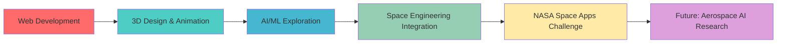

# 🚀 Hany Ehab - Space Engineering & AI/ML Explorer

<div align="center">
  
  
  
  [](https://git.io/typing-svg)

</div>

---

## 🎯 **Current Mission**

```python
class SpaceEngineer:
    def __init__(self):
        self.name = "Hany Ehab"
        self.age = 20
        self.specialization = "Navigation & Space Technology"
        self.current_focus = "AI/ML × Space Engineering"
        self.mission = "Revolutionize space technology with artificial intelligence"
        
    def current_projects(self):
        return {
            "NASA_Space_Apps_2025": {
                "role": "Technical Lead",
                "project": "Exoplanet Detection ML Pipeline",
                "status": "Advanced Python/OOP skills, actively learning NumPy/Pandas",
                "team_size": 3,
                "goal": "Build ML system for transit photometry analysis"
            },
            "research_interest": "Large Language Models in Aerospace Applications",
            "learning_path": ["Python", "NumPy", "Pandas", "Scikit-learn", "Deep Learning"]
        }
```

---

## 🛰️ **Space Tech Arsenal**

### **Programming Languages**
<p align="left">
  
  
  
  
  
  
</p>

### **Learning Stack (AI/ML for Space)**
<p align="left">
  
  
  
  
</p>

### **Development Tools**
<p align="left">
  
  
  
  
</p>

---

## 📊 **Mission Statistics**

<div align="center">
  
  
  
  

</div>

---

## 🌌 **Learning Journey**



### **🎯 NASA Space Apps Challenge 2025 - Learning Progress**

<div align="center">

| Phase | Topic | Status | Progress |
|-------|-------|--------|----------|
| 0️⃣ | Basic Python Practice | ✅ |  |
| 1️⃣ | Python Fundamentals | ✅ |  |
| 2️⃣ | Object-Oriented Programming | 🔄 |  |
| 3️⃣ | NumPy | 🔄 |  |
| 4️⃣ | Pandas | 🔄 |  |
| 5️⃣ | Scikit-learn | ⏳ |  |
| 6️⃣ | Matplotlib | ⏳ |  |
| 7️⃣ | NASA Challenge Prep | 🔄 |  |

**Current Focus**: Building ML pipeline for exoplanet detection using transit photometry

</div>

---

## 🚀 **Featured Repositories**

<div align="center">

[](https://github.com/hany73-max/Programming-Projects)
[](https://github.com/hany73-max/learning-along-the-way)

</div>

---

## 🛸 **Research Interests**

### **🤖 Large Language Models in Aerospace**
- **Mission Planning**: AI-assisted trajectory optimization
- **Autonomous Systems**: Natural language spacecraft interfaces  
- **Data Analysis**: Intelligent telemetry processing
- **Documentation**: Automated technical writing

### **🌟 Future Research Directions**
- Smart navigation systems for autonomous spacecraft
- Predictive maintenance for satellite operations  
- AI-powered communication and error correction
- Intelligent mission control assistants

---

## 🎨 **Creative Projects**

<div align="center">

### **3D Space Visualizations**
*Blender projects showcasing space environments and educational content*

| Project Type | Description | Skills |
|--------------|-------------|--------|
| 🌍 **Planetary Systems** | Realistic planet models with accurate textures | Hard surface modeling, PBR materials |
| 🚀 **Spacecraft Models** | Technical recreations of satellites and probes | Precision modeling, technical accuracy |
| 🌌 **Space Environments** | Nebulae, star fields, cosmic phenomena | Procedural texturing, lighting design |
| 🎬 **Educational Animations** | Physics concepts and space exploration | Rigging, keyframe animation |

</div>

---

## 📈 **GitHub Activity**

<div align="center">
  
  

</div>

---

## 🌟 **Goals & Vision**

<div align="center">

### **Short-term (6 months)**
🎯 Complete NASA Space Apps Challenge with functional ML system  
📚 Master Python data science stack (NumPy, Pandas, Matplotlib)  
🚀 Build first AI/ML project for space applications  
💼 Develop comprehensive programming portfolio  

### **Long-term (2-3 years)**
🔬 Specialize in AI/ML applications for space engineering  
🌍 Contribute to open-source space technology projects  
📖 Research thesis combining AI/ML with navigation systems  
🏢 Gain industry experience in aerospace AI/ML applications  

</div>

---

## 🤝 **Let's Connect & Collaborate**

<div align="center">

[](https://www.linkedin.com/in/hany-ehab-1525b02a7)
[](https://github.com/hany73-max)
[](mailto:hanyelashry323@gmail.com)

**Looking to connect with:**
- 🛰️ Space Engineering Students & Professionals
- 🤖 AI/ML Practitioners & Researchers  
- 🚀 Aerospace Industry Professionals
- 🔬 Academic Research Groups

</div>

---

<div align="center">
  
  
  
  **"Exploring the cosmos through code, one algorithm at a time"** 🌌
  
  

</div>